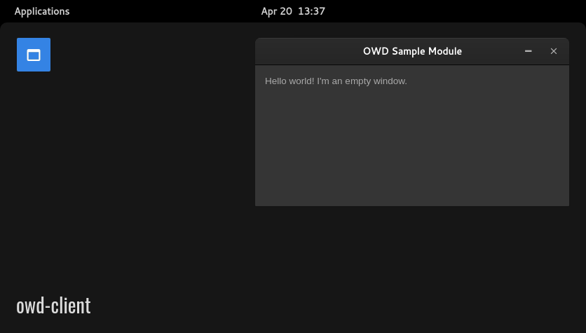

# Chat module for OWD Client
> A basic chat module for Open Web Desktop

<p>
    
</p>

<p>
    <a href="LICENSE"></a>
    <a href="https://github.com/owdproject/owd-client"></a>
    <a href="https://github.com/topics/owd-modules"></a>
    <a href="https://hacklover.net/patreon"></a>
    <a href="https://hacklover.net/discord"></a>
</p>

## Overview
An app boilerplate for your Open Web Desktop client

## Quick install
- Move to your client folder, then
  ```
  # Enter modules app directory
  cd src/modules/app/
  
  # Clone this repository
  git clone https://github.com/hacklover/owd-app-chat chat
  ```
- Define this module in `owd-client/client.extensions.ts`
  ```js
  import AboutModule from "@owd-client/core/src/modules/app/about";
  //import DebugModule from "@owd-client/core/src/modules/app/debug";
  import ChatModule from "~/modules/app/chat/client";

  export default {
    app: {
      modules: [
        AboutModule,
        //DebugModule,
        ChatModule,
      ]
    },
    ...
  ```

## Compatibility
- Open Web Desktop client v2.0.0-beta.1

## License
This project is released under the [MIT License](LICENSE)